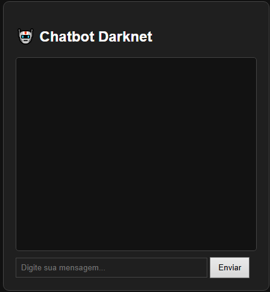

# 🤖 Chatbot Gemini com Flask  
Um chatbot simples e moderno usando **Google Gemini + Flask**, com suporte a **tema Dark/Light automático**, interface limpa e API organizada.

Este projeto permite que qualquer pessoa rode um chatbot usando a API oficial da Google, com front-end em HTML/CSS/JS e servidor Flask em Python.

---

## 🚀 Funcionalidades

✔ Integração com **Google Gemini**  
✔ Chat em tempo real  
✔ Tema **Dark/Light automático**  
✔ Botão para alternar tema manualmente  
✔ HTML + CSS modernos  
✔ Código organizado e limpo  
✔ API em Flask  
✔ Pronto para deploy (Render, Vercel, Railway etc.)

---

## 📷 Preview da Interface



---

## 📌 **Requisitos**

Antes de tudo, instale:

- Python 3.10+  
- Pip (gerenciador de pacotes)  
- Uma chave de API do **Google Gemini AI**  
  👉 Crie sua chave em: https://aistudio.google.com/app/apikey

⚠ **IMPORTANTE:**  
> Você PRECISA colocar sua própria API KEY no arquivo `.env`.  
> Sem isso, o chatbot não irá funcionar.

---

## 📥 Instalação

Clone o repositório:

```bash
git clone https://github.com/SEU_USUARIO/chatbot-gemini-flask.git
cd chatbot-gemini-flask
